# Wind Turbine Blade: Structural Analysis & ML Prediction

An engineering design tool and machine learning framework that evaluates and predicts wind turbine blade structural responses—specifically **equivalent von-Mises stress** and **tip deflection**—under varying geometric shapes, materials, and aerodynamic wind loads.

By bridging the gap between heavy numerical finite element simulations and rapid design iterations, this framework integrates **aerodynamic Blade Element Momentum (BEM) theory, parametric CAD modeling, FEA simulations, and predictive Machine Learning pipelines** into a single, cohesive workflow.

---

## Project Overview

Designing wind turbine blades is a balancing act between aerodynamic output and structural limits. Evaluating a new blade geometry typically requires editing CAD models and running hours of computationally expensive Finite Element Analysis (FEA) inside solvers like ANSYS or Abaqus. This creates a severe bottleneck in the early exploration phase. 

This repository solves this bottleneck. By training machine learning pipelines over a multi-variable parametric design space, we can bypass the heavy FEA steps during initial iterations. The result? **Instantaneous structural predictions**—learning the underlying patterns of stress and deflection from simulation data—allowing engineers to perform rapid parameter sweeps and design space exploration in seconds.

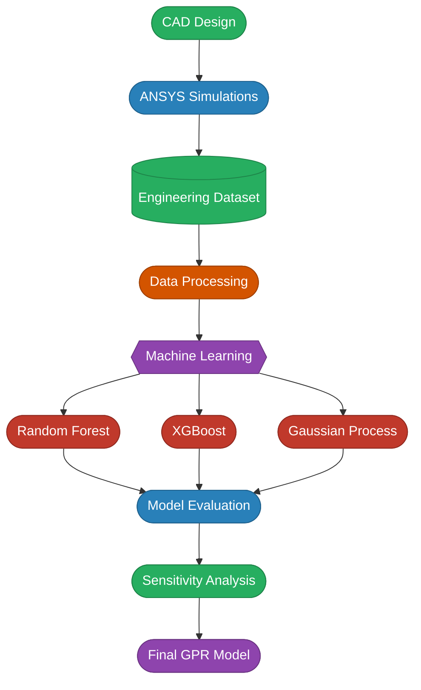

---

## Project Structure

```
├── ANSYS/              # FEA simulation scripts & results
├── CAD/                # Parametric blade geometry models
├── Dataset/            # Multi-variable training dataset
├── Notes/              # Design iteration & research notes
├── Python/             # Jupyter notebooks (exploration, training, analysis)
├── Visualisations/     # Plots, charts & exported figures
├── models/             # Serialized trained models
├── src/                # Core Python package (processing, ML, utilities)
├── predict.py          # CLI: one-shot structural prediction
├── requirements.txt    # Python dependencies
└── train_and_save_models.py  # CLI: train & persist ML models
```

---

## Aerodynamics & Structural Physics Foundations

### 1. Cantilever Beam Analogy
Structurally, a wind turbine blade behaves like a tapered, twisted cantilever beam. The blade is rigidly fixed at the rotor hub (the root) and projects out freely to the tip, bearing the brunt of aerodynamic forces.

* **Bending Moment ($M$):** $M(x) = \int_{x}^{L} q(r)(r - x) \, dr$, where $q(r)$ represents the aerodynamic line load distribution.
* **Moment of Inertia ($I$):** For hollow airfoil profiles, bending stiffness is dictated by $E \cdot I$, where $E$ is the material's Young's Modulus and $I$ is the second moment of area (governed by the airfoil's chord and thickness).
* **Normal Bending Stress ($\sigma$):** $\sigma = \frac{M \cdot y}{I}$, where $y$ is the distance from the cross-section's neutral axis to its outer fibers.

### 2. High-Fidelity Power Scaling Laws
Applying classical Euler-Bernoulli beam theory reveals that the blade's structural performance is highly sensitive to its physical dimensions:
* **Deflection ($\delta$):** Scales proportionally to the fourth power of length ($L$) and inversely to the cube of the chord ($c$):
  $$\delta \propto \frac{L^4}{c^3}$$
* **Bending Stress ($\sigma$):** Scales with the square of length ($L$) and inversely with the square of the chord ($c$):
  $$\sigma \propto \frac{L^2}{c^2}$$

> **Why do these scaling exponents remain constant despite the complex twist and taper?** 
> 
> Under a steady wind load, total aerodynamic force scales with the projected blade area ($F \propto P \cdot L \cdot c$). Because our blade profiles are aerodynamically scaled (thickness is a constant ratio of local chord, $t \propto c$), the cross-sectional moment of inertia scales as $I \propto c^4$. 
> 
> While the blade is tapered and twisted along its span, **geometric self-similarity** is maintained—the relative taper profile ($c_{\text{tip}}/c_{\text{root}}$) and twist distribution relative to span fraction ($r/L$) remain identical across all models. When integrated along the length of the beam, these geometric variations condense into a constant, dimensionless scaling multiplier (a "shape factor"). Consequently, the twist and taper do not alter the underlying power exponents; the deflection and stress scaling laws remain intact.

This means that modifying geometric dimensions—specifically extending blade lengths or adjusting chord taper—affects the structure far more aggressively than changing materials.

<p align="center">
  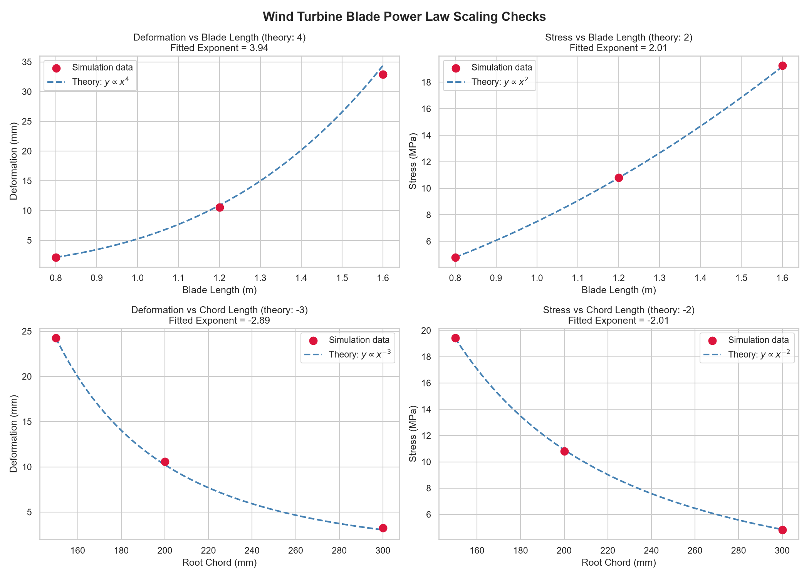
</p>

### 3. Aerodynamic Loads, Betz Limit, and BEM Theory
* **Lift ($L_F$) & Drag ($D_F$):** BEM theory calculates the aerodynamic loading by modeling the relative velocities at each span element, translating airfoil drag and lift distributions into axial and angular induction factors.
* **Twist Distribution:** Because rotational velocity increases linearly toward the tip ($v = \Omega \cdot r$) while the incoming wind speed remains constant, the relative wind angle changes along the blade's span. We twist the blade from root to tip to maintain an optimal **Angle of Attack (AoA)**.
* **Betz Limit & Wake Losses:** Fluid motion dictates that the maximum kinetic energy capture from wind is capped at **59.3%** (the Betz Limit). In practice, wake rotation (the swirl left in the wake of the rotor) reduces this efficiency, which is modeled using BEM theory induction factors.

---

## Parametric CAD & Mesh Convergence

We parameterized the 3D blade geometry in Autodesk Fusion 360 using the aerodynamic **NACA 4412 airfoil profile**:

<p align="center">
  
  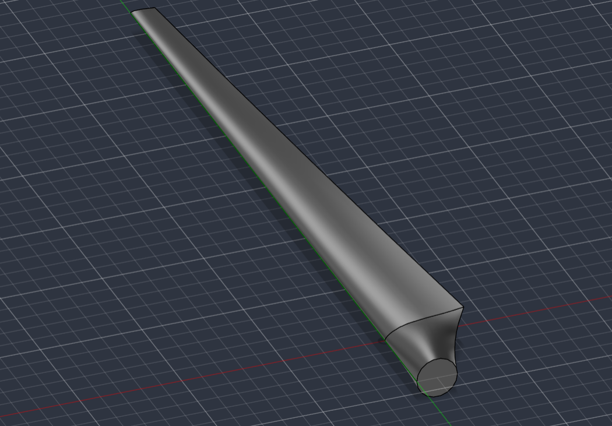
</p>

### 1. Chord Taper Formula
To reduce excessive tip mass, minimize the bending moment arm, and decrease aerodynamical drag, the chord length decreases linearly from the root to the tip according to:
$$c(r) = C_{\text{root}} \left( 1 - 0.7 \frac{r}{L_{\text{blade}}} \right)$$

### 2. Twist Distribution
The aerodynamic angle of attack changes progressively across the blade's span to maintain an optimal angle of attack:
* **0% span (Hub/Root):** $14.0^\circ$
* **25% span:** $10.5^\circ$
* **50% span:** $7.5^\circ$
* **75% span:** $4.7^\circ$
* **100% span (Tip):** $2.0^\circ$

### 3. Mesh Convergence Study
Before generating our database, we performed a mesh sensitivity study inside ANSYS Mechanical to balance numerical accuracy and compute costs. By analyzing how different element sizes affect equivalent stress findings, we identified:
* **Selected Element Size:** $3 \times 10^{-3}\text{ m}$ ($3\text{ mm}$) global size.
* **Rationale:** This size is the exact convergence inflection point. Choosing smaller sizes yielded less than a $0.5\%$ change in stress values, while larger mesh sizes failed to capture the high-strain regions at the trailing edge.

<p align="center">
  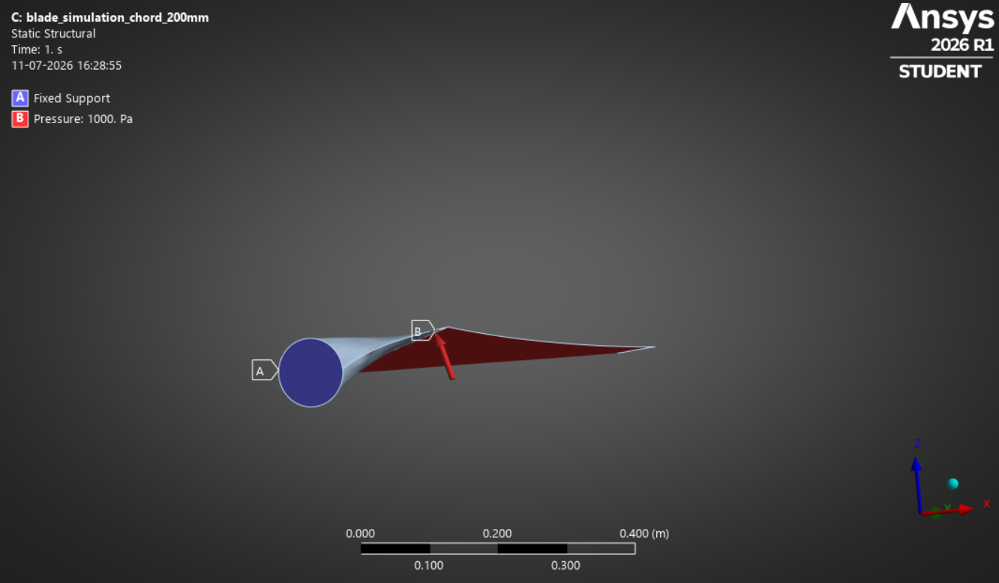
  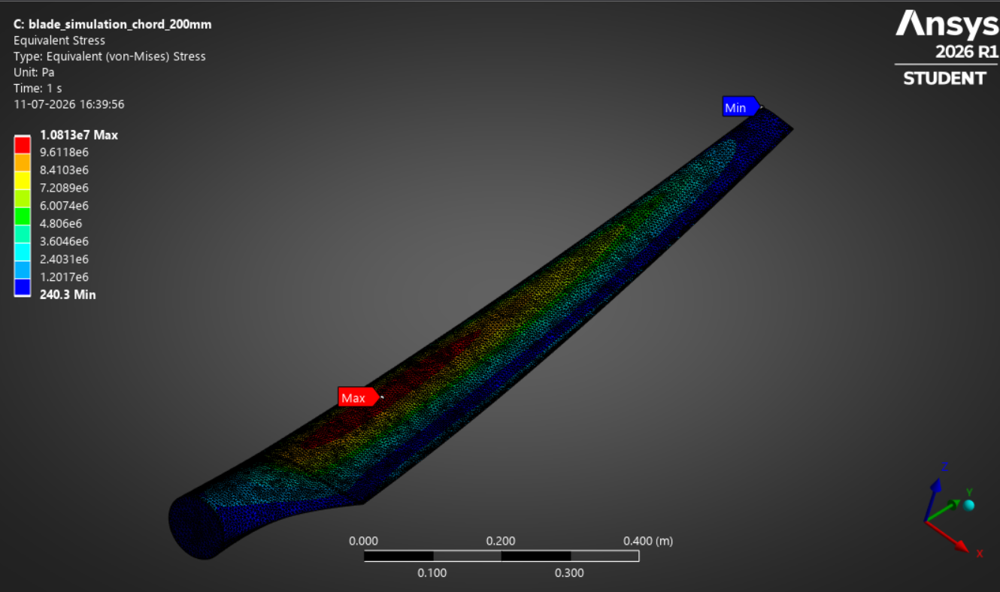
</p>

---

## Database Building (Design of Experiments)

To compile our training dataset, we ran a full $3^4$ factorial Design of Experiments (DoE) in ANSYS Mechanical, executing and extracting **81 high-fidelity structural simulations** that cover the boundary extremes of our design envelope:

### Parametric Design Levels:
1. **Blade Length ($L_{\text{blade}}$):** $0.8\text{ m}$, $1.2\text{ m}$, $1.6\text{ m}$ (capturing small-to-utility scale limits)
2. **Root Chord Length ($C_{\text{root}}$):** $150\text{ mm}$, $200\text{ mm}$, $300\text{ mm}$ (spanning slender to stocky geometries)
3. **Applied Pressure (Wind Load):** $500\text{ Pa}$, $1000\text{ Pa}$, $1500\text{ Pa}$ (representing different wind load conditions from low to high)
4. **Blade Material (Isotropic Properties):**
   * **Aluminium Alloy:** $\rho = 2700\text{ kg/m}^3$, $E = 69\text{ GPa}$, $\nu = 0.33$
   * **Fiberglass Composite:** $\rho = 1900\text{ kg/m}^3$, $E = 25\text{ GPa}$, $\nu = 0.22$
   * **Carbon Fiber Composite:** $\rho = 1600\text{ kg/m}^3$, $E = 120\text{ GPa}$, $\nu = 0.28$

All simulation outputs mapping peak equivalent stress (MPa) and tip deflection (mm) are stored in [Dataset/simulation_matrix_updated_info.csv](Dataset/simulation_matrix_updated_info.csv).

---

## Machine Learning Predictor

Our machine learning subsystem trains regressors using `scikit-learn`. The architecture wraps preprocessing steps and regression estimators into fully unified, reproducible pipelines to avoid silent feature leakage.

### Model Overviews
* **Random Forest:** An ensemble method that constructs multiple decision trees during training to output the mean prediction of individual trees, reducing overfitting while capturing non-linear relationships.
* **XGBoost:** A powerful gradient boosting implementation that builds decision trees sequentially, focusing on correcting the errors of previous trees to achieve highly accurate, fine-tuned predictions.
* **Gaussian Process Regression (GPR):** A non-parametric Bayesian approach that models data as a distribution over functions. It provides not just predictions, but also a measure of uncertainty (confidence intervals) for every output, making it highly suitable for engineering applications.

### Data Preprocessing
To prepare simulation data for training:
* **Numerical Features** (Blade Length, Root Chord, and Applied Load) are normalized using a `StandardScaler`.
* **Categorical Features** (Material) are one-hot encoded.
* **Information Isolation:** These estimators are combined under a `ColumnTransformer` embedded directly inside our pipeline. This ensures preprocessing parameters are only fit on training splits, preventing **data leakage** during cross-validation folds.

### Model Performance Comparison (Test Set Metrics)

We evaluated all three regressors on held-out test splits. Because our data is a factorial grid, an 80/20 split holds out new *combinations* of factor levels, not new values. These metrics show how well each model reproduces the grid; true in-between interpolation is measured later via the power-law sweeps. The Gaussian Process Regression (GPR) achieved near-perfect performance on both targets:

| Target | Metric | Random Forest | XGBoost | **GPR (Final)** |
| :--- | :---: | :---: | :---: | :---: |
| **Equivalent Stress** | MAE | 1.747 MPa | 0.072 MPa | **0.0013 MPa** |
| | RMSE | 2.234 MPa | 0.086 MPa | **0.0016 MPa** |
| | $R^2$ | 0.9388 | 0.9999 | **1.0000** |
| **Deflection** | MAE | 11.299 mm | 11.512 mm | **0.0016 mm** |
| | RMSE | 20.172 mm | 22.862 mm | **0.0031 mm** |
| | $R^2$ | 0.6960 | 0.6097 | **1.0000** |

### Cross-Validation Results

A single train/test split can be misleading, so we repeated the comparison under **5-fold cross-validation** (shuffled, `random_state=42`). Every model was scored five times, giving us both the mean $R^2$ and a sense of how stable it is:

| Target | Metric | Random Forest | XGBoost | **GPR** |
| :--- | :---: | :---: | :---: | :---: |
| **Equivalent Stress** | Mean $R^2$ (5-fold) | 0.941 ± 0.027 | 0.9997 ± 0.0005 | **1.0000 ± 0.0000** |
| | Mean MAE | 1.801 ± 0.583 MPa | 0.082 ± 0.038 MPa | **0.0025 ± 0.0019 MPa** |
| **Deflection** | Mean $R^2$ (5-fold) | 0.375 ± 0.466 | 0.644 ± 0.080 | **1.0000 ± 0.0000** |
| | Mean MAE | 14.00 ± 8.33 mm | 11.89 ± 8.24 mm | **0.0026 ± 0.0024 mm** |

<p align="center">
  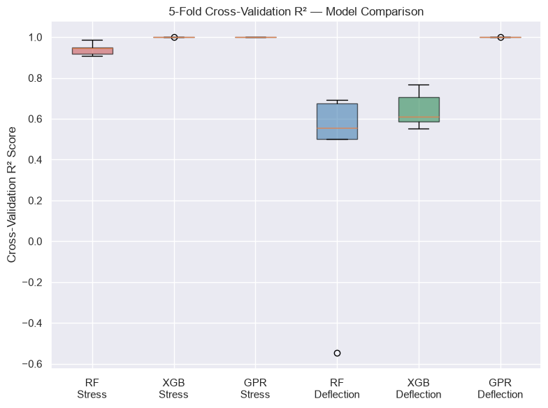
  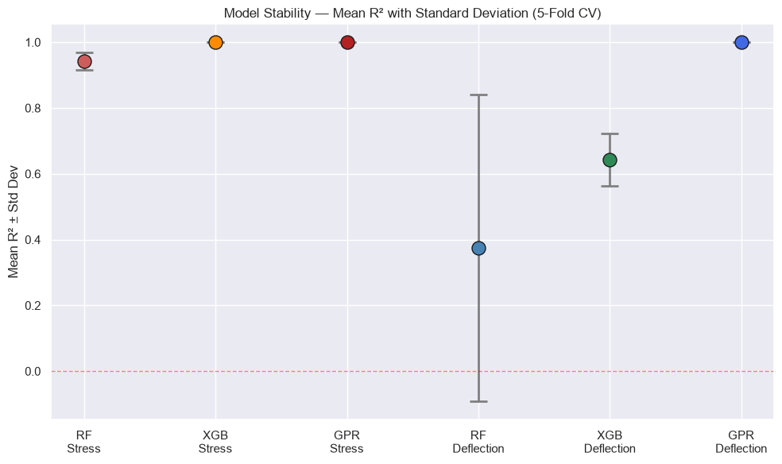
</p>

**Key insights:**
1. **GPR is perfect *and* consistent.** It achieves $R^2 = 1.0000$ in **every** fold for both targets (per-fold $R^2 = [1, 1, 1, 1, 1]$). The near-perfect scores aren't a one-off lucky split — the model's grid reproduction is exceptionally stable.
2. **Random Forest breaks down on deflection.** A CV $R^2$ of $0.375 \pm 0.466$ swings wildly between folds, sometimes near-zero, because it can't represent the $L^4$ power-law behaviour. It simply isn't a reliable deflection model.
3. **XGBoost shows the same weakness as on the test set.** Strong on stress ($0.9997$), but drops to $0.644$ on deflection.
4. **Cross-validation and the test set agree.** GPR is the only model that hits both targets consistently, in every fold. That's what drove the model selection below.

### Model Selection Rationale

GPR was chosen as the final model over Random Forest and XGBoost for three reasons:

1. **First model to master both targets.** Random Forest was decent on stress (R² 0.939) but unreliable on deflection (R² 0.696). XGBoost was near-perfect on stress (R² 0.9999) but overfit deflection (R² 0.6097 vs 0.999 train). GPR achieves R² 1.0000 on **both**, with near-zero error across the board. One unified model for the entire prediction tool.

2. **Uncertainty quantification built in.** Unlike tree-based methods that return point estimates, GPR is Bayesian — every prediction comes with a confidence interval. For engineering decisions, knowing *how sure the model is* matters as much as the prediction itself.

3. **Extracts more from the same data.** The anisotropic RBF kernel learns a separate length scale per input feature, letting the model automatically discover which parameters matter and at what resolution. The log-transform wrapper (`TransformedTargetRegressor` with `func=np.log`) turns power-law relationships into roughly linear ones, so the GP fits steep, multi-scale targets without numerical strain.

**Why is GPR this accurate?** It comes down to the kind of function FEA produces. Our targets are smooth and deterministic — same inputs, same outputs — and with a tiny noise term (`alpha = 1e-8`) a Gaussian Process behaves like an *exact interpolator*: the prediction passes right through every training point and fills the gaps with smooth curves. Random Forest and XGBoost can't do that. They're piecewise-constant, so on the steep $L^4$ deflection ramp they approximate with flat steps and simply saturate. The log-transform helps too, flattening these power laws into nearly straight lines that the RBF kernel fits easily. The catch: this accuracy only holds *inside* the trained envelope. Push past the design limits and the GP predictions drift, which is why the prediction tool blocks out-of-range inputs.

### Model Learning Curves

To diagnose model convergence and stability, we plotted GPR learning curves across training set size increments. Training and validation scores at each step were calculated using 5-fold cross-validation:
* **Stress Predictor:** R² = 1.0 at every training size — the GP captures the stress function perfectly from the very first slice.
* **Deflection Predictor:** Same result — R² = 1.0 throughout, no gap between train and validation scores.

**Diagnosis:** Both models are "Well-fitted" — no overfitting, no underfitting, no indication that more data would meaningfully improve results. The 81 simulations contain enough information; GPR simply extracts it more completely than tree-based alternatives.

<p align="center">
  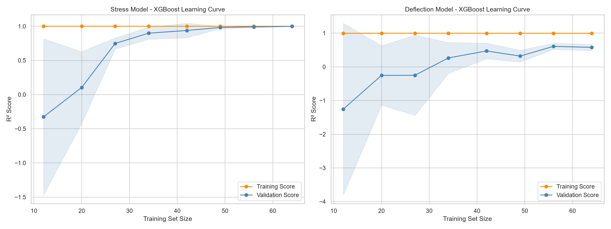
</p>

### Key ML Insights:
1. **Stress is purely geometric and material-independent.** Peak bending stress depends only on geometry and load — Young’s modulus does not appear in the stress formula. The GPR nails this smooth, deterministic relationship (R² 1.0, MAE 0.0013 MPa) because the ARD kernel easily separates the three geometric inputs from the three one-hot material columns (which it correctly learns to ignore).
2. **Deflection requires joint geometry–material learning.** Deflection couples blade geometry (L⁴ power law) with material stiffness. The anisotropic RBF kernel handles this by assigning each input a dedicated length scale — a separate resolution for Blade Length (metre scale), Chord Length (centimetre scale), and material (binary). This per-feature adaptability is what lets GPR exceed tree-based models on a small 81-sample dataset.

---

## Sensitivity Analysis & Structural Recommendations

Using the trained GPR models, we performed parameter sweeps across the full design boundary range to establish practical structural guidelines for blade optimization.

### Design Variable Sensitivity Sweeps:
To evaluate individual parameters, we swept each variable across its full range while holding baseline configurations constant at: $L = 1.2\text{ m}$, $C_{\text{root}} = 300\text{ mm}$, Carbon Fiber material, and Wind Load = $1000\text{ Pa}$.

| Rank | Design Parameter | Bending Stress Sweep | Tip Deflection Sweep | System Influence | Engineering Rationale |
| :---: | :--- | :---: | :---: | :---: | :--- |
| **1** | **Blade Length** | 4.02× increase | 15.59× increase | **Critical** | Governs the bending moment lever arm ($\delta \propto L^4$). |
| **2** | **Chord Length** | 4.02× decrease | 7.43× decrease | **Critical** | Controls cross-sectional moment of inertia. |
| **3** | **Blade Material** | ~1.0× (No effect) | 4.80× reduction | **Moderate** | Governs structural deflection only; has no effect on stress. |
| **4** | **Applied Load** | 3.00× increase | 3.00× increase | **Moderate** | Dictates bending moment ($\sigma \propto M \propto F$). |

### Verifying the Power Scaling Laws
The sweep ratios match the Euler-Bernoulli scaling laws introduced in the theory section. By performing 50-point dense sweeps through the trained GPR surrogate and fitting log-linear power-law regressions to the resulting curves, we recover the theoretical exponents with remarkable fidelity:

| Relationship | Theory | GPR Fitted Exponent | Deviation |
| :--- | :---: | :---: | :---: |
| Deflection vs Blade Length | $\delta \propto L^4$ | 4.02 | +0.5% |
| Stress vs Blade Length | $\sigma \propto L^2$ | 2.04 | +2.0% |
| Deflection vs Chord Length | $\delta \propto c^{-3}$ | −2.94 | −2.0% |
| Stress vs Chord Length | $\sigma \propto c^{-2}$ | −2.04 | −2.0% |

The plot below overlays the continuous GPR surrogate predictions (solid curves) against the theoretical power laws (dashed grey) normalised at the sweep midpoint. The near-perfect overlap demonstrates that the Gaussian Process has internalised the underlying beam mechanics from the 81-sample FEA dataset — without any physics constraints imposed during training.

<p align="center">
  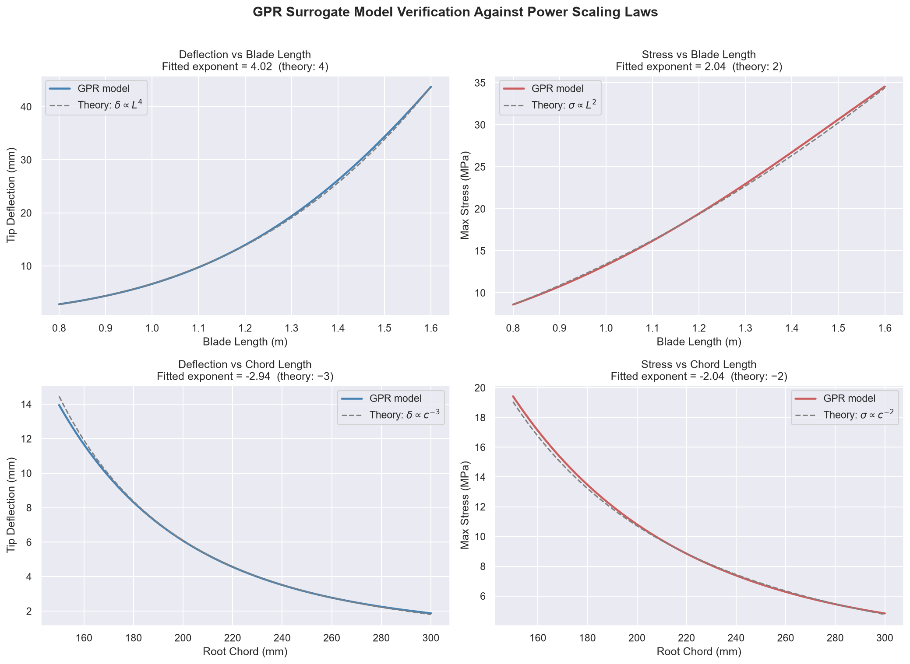
</p>

The remaining two parameters complete the picture. **Applied load** scales linearly with both stress and deflection ($\sigma \propto F$, $\delta \propto F$), and the GPR model captures this exactly — a 3× increase in load (500 → 1500 Pa) produces a **3.00×** increase in both targets, matching the theoretical prediction to three significant figures.

<p align="center">
  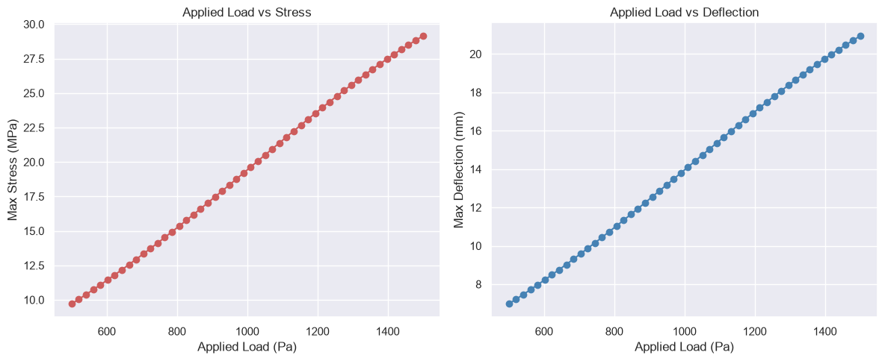
</p>

**Material stiffness** ($E$) enters the beam equations only through the bending stiffness term $EI$. Because stress is governed by the ratio $M/I$ (where $I \propto c^4$), Young's modulus cancels out entirely — the GPR confirms this with a stress ratio of **1.0003×** across all three materials. Deflection, however, scales as $\delta \propto 1/E$. The model predicts a **4.80×** reduction from Fiberglass ($E \approx 25\text{ GPa}$) to Carbon Fiber ($E \approx 120\text{ GPa}$), matching the theoretical ratio $120/25 = 4.8$ exactly.

### Core Engineering Insights:
1. **Curbing Deflection:** Deflection is dominated by blade length — extending from $0.8\text{ m}$ to $1.6\text{ m}$ produces a **15.6×** increase. To prevent structural tower strikes, designers must increase root chord or switch to stiffer materials. Specifically, Carbon Fiber reduces tip deflection by **4.8×** compared to Fiberglass.
2. **Minimizing Stress Concentrations:** Since material stiffness ($E$) does not affect peak stress (ratio 1.0003×), changing materials is ineffective for stress mitigation. Peak stress reduction must be solved geometrically — shortening the moment arm ($L$) or enlarging the root chord ($c$), each reducing stress by **4.0×** across the design range.

---

## Getting Started

### 1. Environment Setup
This project requires **Python 3.10+**. To set up the local virtual environment and install all packages:

**Windows (Command Prompt or PowerShell):**
```bash
# Navigate to the project root directory
cd Wind_Turbine_Project

# Create a virtual environment
python -m venv .venv

# Activate the virtual environment
.venv\Scripts\activate

# Install local package dependencies
pip install -r requirements.txt
```

**macOS / Linux:**
```bash
# Navigate to the project root directory
cd Wind_Turbine_Project

# Create a virtual environment
python3 -m venv .venv

# Activate the virtual environment
source .venv/bin/activate

# Install local package dependencies
pip install -r requirements.txt
```

### 2. Model Training
To retrain the regression pipelines from raw simulation logs and save the serialized models directly to the `models/` directory:

```bash
python train_and_save_models.py
```

### 3. Interactive Predictions
To compute predictions for custom configurations in real-time, launch the command-line evaluation tool:

```bash
python predict.py
```

#### Example Interactive Command Line Run:
This example deliberately uses an **off-grid configuration** — no input sits at a DoE level, so this exact combination was never part of the 81 training simulations. The results below are genuine surrogate interpolation, not a memorized FEA answer.

```text
======================================================================
                 Wind Turbine Blade Prediction System                 
======================================================================

Loading trained models...
✓ Models loaded successfully!

Please enter the blade parameters:

Blade Length (m): 1.3
Chord Length (mm): 180

Available materials: Aluminium, Fiberglass, Carbon fiber
Material: Carbon fiber
Applied Load (Pa): 1200

Input Parameters:
├─ Blade Length  : 1.30 m
├─ Chord Length  : 180 mm
├─ Material      : Carbon fiber
└─ Applied Load  : 1200 Pa

Computing predictions...

──────────────────────────────────────────────────────────────────────
Prediction Results:
──────────────────────────────────────────────────────────────────────

  Maximum Equivalent Stress:
    19.42 MPa

  Maximum Deflection:
    14.05 mm

──────────────────────────────────────────────────────────────────────

======================================================================

Make another prediction? (y/n): n

Thank you for using the Wind Turbine Blade Prediction System!
```

The application warns you immediately if your inputs exceed training limits, maintaining strict bounds compliance.

### Off-Grid Validation

To verify the surrogate actually interpolates between training levels rather than just memorising the grid, one ANSYS simulation was run at the exact off-grid configuration above (1.3 m, 180 mm, Carbon Fiber, 1200 Pa):

| Metric | GPR Prediction | ANSYS Ground Truth | Error |
| :--- | :---: | :---: | :---: |
| Equivalent Stress | 19.42 MPa | 18.85 MPa | +3.0% |
| Tip Deflection | 14.05 mm | 13.67 mm | +2.8% |

<p align="center">
  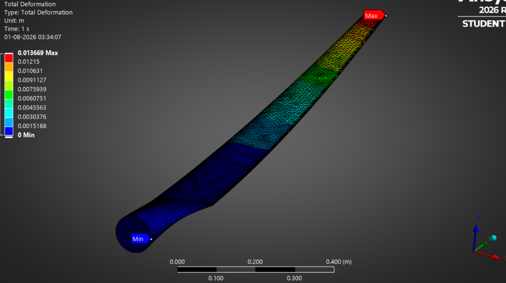
  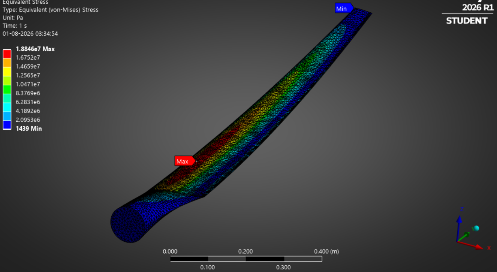
</p>

A ~3% error at a point off-grid in three variables simultaneously confirms the GP has internalised the underlying beam mechanics rather than just memorising the 81-point factorial. This is consistent with the power-law sweep's ~2% exponent deviations and provides the concrete absolute-accuracy number that the test-set R² — which only measures grid reproduction — cannot.

---

## Limitations & Future Work

* **Static Loading Assumption:** Currently, the loadings are modeled as steady-state pressure profiles, neglecting transient turbine rotation forces (centrifugal tension, Coriolis acceleration, gravity cycles).
* **Isotropic Materials:** Structural FEA calculations assume isotropic material properties. Modeling fiber-reinforced FRP composite laminates using anisotropic ply layups would enhance accuracy.
* **Aerodynamic Coupling:** Real wind turbine blades undergo structural deflection under aerodynamic lift and drag, which changes the blade angle of attack. This elastic feedback loop (Fluid-Structure Interaction - FSI) is not captured by decoupled static models.
* **Rotor Fatigue:** The simulation does not perform fatigue cycles analysis, which governs commercial blade design operating lives (typically 20-30 years).
* **Surrogate & Analysis Scope:** The model is only valid within the sampled design envelope (0.8–1.6 m, 150–300 mm chord, 500–1500 Pa, three materials) — beyond it the GP has no training support. It is validated against ANSYS alone, never a physical blade, and the 81-point grid fills gaps via the kernel's smoothness assumption. The underlying FEA also assumes small deflections, so nonlinear behaviour at the envelope's extremes is not captured.

---

Developed by Anish Gangavaram.
